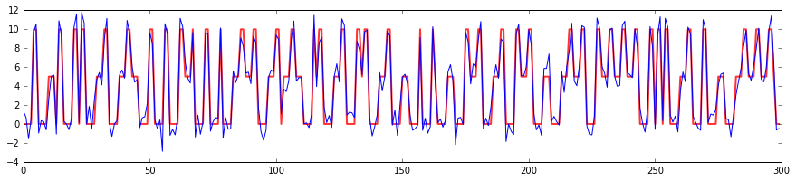
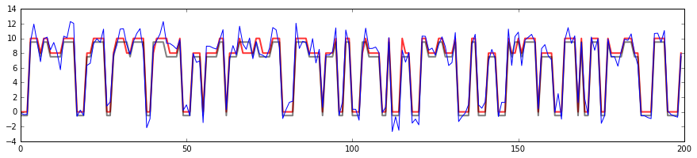
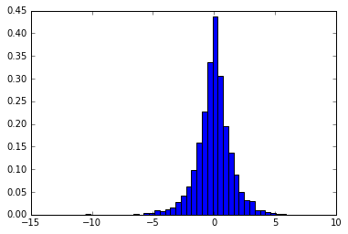
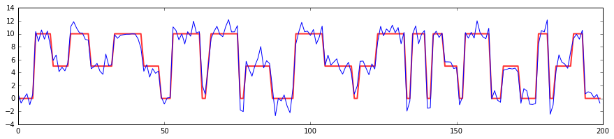

Tutorial
========

In this tutorial we'll explore the two main pieces of functionality that
``HSMMLearn`` provides:

-  Viterbi decoding: given a sequence of observations, find the sequence
   of hidden states that maximizes the joint probability of the
   observations and the states.
-  Baum-Welch model inference: given a sequence of observations, find
   the model parameters (the transition and emission matrices, and the
   duration distributions) that maximize the probability of the
   observations given the model.

In case you are reading this as part of the Sphinx documentation, there
is an IPython 4 notebook with the contents of this tutorial in the
``notebooks/`` folder at the root of the repository.

.. code:: python

    import numpy as np
    import matplotlib.pyplot as plt

.. code:: python

    %matplotlib inline

Decoding
--------

For this part of the tutorial we'll use an HSMM with 3 internal states
and 4 durations 1, ..., 4. We'll stick to using Gaussian emissions
throughout (i.e. the probability density of the observations given the
state is a 1D Gaussian with a fixed mean and standard deviation), but
discrete observations (or observations modeled on another class of PDF)
can be slotted in equally easily.

The transition matrix is chosen so that there are no self-transitions
(all the diagonal elements are 0). This forces the system to go to a
different state at the end of each duration. This is not strictly
necessary, but allows us to visualize the effect of the different
durations a little better.

The duration matrix is chosen so that for state 1, there is a 90% chance
of having the duration equal to 4, and 10% duration 1. For state 2 and
3, there is a 90% probability of having duration 3, resp. 2. As the
duration lengths don't differ much, this won't be very visible, but for
sparse duration distributions with many durations it does make a
difference.

For the emission PDFs, we choose clearly separated Gaussians, with means
0, 5, and 10, and standard deviation equal to 1 in each case.

.. code:: python

    from hsmmlearn.hsmm import GaussianHSMM
    
    durations = np.array([
        [0.1, 0.0, 0.0, 0.9],
        [0.1, 0.0, 0.9, 0.0],
        [0.1, 0.9, 0.0, 0.0]
    ])
    tmat = np.array([
        [0.0, 0.5, 0.5],
        [0.3, 0.0, 0.7],
        [0.6, 0.4, 0.0]
    ])
    
    means = np.array([0.0, 5.0, 10.0])
    scales = np.ones_like(means)
    
    hsmm = GaussianHSMM(
        means, scales, durations, tmat,
    )

Having initialized the Gaussian HSMM, let's sample from it to obtain a
sequence of internal states and observations:

.. code:: python

    observations, states = hsmm.sample(300)

.. code:: python

    print(states[:20])

.. parsed-literal::

    [2 2 1 1 1 2 2 0 0 0 0 2 2 1 1 1 2 2 1 1]

.. code:: python

    print(observations[:20])

.. parsed-literal::

    [ 10.52314041   9.86235128   4.07406132   5.44132853   5.76402099
      11.43504019  10.13734856  -0.93207824   0.75532059  -1.29944693
      -0.47906227   9.9658948   10.36830046   3.4782257    4.58492773
       5.10710389   8.49856484  11.92186325   5.41462254   3.9717193 ]

.. code:: python

    fig, ax = plt.subplots(figsize=(15, 3))
    ax.plot(means[states], 'r', linewidth=2, alpha=.8)
    ax.plot(observations)

.. parsed-literal::

    [<matplotlib.lines.Line2D at 0x1131efdd0>]

In the figure, the red line is the mean of the PDF that was selected for
that internal state, and the blue line shows the observations. As is
expected, the observations are clustered around the mean for each state.

Assuming now that we only have the observations, and we want to
reconstruct, or decode, the most likely internal states for those
observations. This can be done by means of the classical Viterbi
algorithm, which has an extension for HSMMs.

.. code:: python

    decoded_states = hsmm.decode(observations)

Given that our Gaussian peaks are so clearly separated, the Viterbi
decoder manages to reconstruct the entire state sequence correctly. No
surprise, and not very exciting.

.. code:: python

    np.sum(states != decoded_states)  # Number of differences between the original and the decoded states

.. parsed-literal::

    0

Things become a little more interesting when the peaks are not so well
separated. In the example below, we move the mean of the second Gaussian
up to 8.0 (up from 5.0), and then we sample and decode again. We also
set the duration distribution to something a little more uniform, just
to make things harder on the decoder (it turns out that otherwise the
decoder is able to infer the internal state sequence almost completely
on the basis of the inferred durations alone).

.. code:: python

    new_means = np.array([0.0, 8.0, 10.0])
    
    hsmm.durations = np.full((3, 4), 0.25)
    hsmm.means = new_means
    
    observations, states = hsmm.sample(200)
    decoded_states = hsmm.decode(observations)

.. code:: python

    np.sum(states != decoded_states)

.. parsed-literal::

    10

.. code:: python

    fig, ax = plt.subplots(figsize=(15, 3))
    ax.plot(new_means[states], 'r', linewidth=2, alpha=.8)
    ax.plot(new_means[decoded_states] - 0.5, 'k', linewidth=2, alpha=.5)
    ax.plot(observations)

.. parsed-literal::

    [<matplotlib.lines.Line2D at 0x113d12d90>]

In the figure, the red line again shows the mean of the original
sequence of internal states, while the gray line (offset by 0.5 to avoid
overlapping with the rest of the plot) shows the reconstructed sequence.
They track each other pretty faithfully, except in areas where the
observations give not much information about the internal state.

Aside: different emission PDFs
------------------------------

In the previous example, we worked throughout with an instance of the
class ``GaussianHSMM``. This is a convenience wrapper around a more
general class ``hsmmlearn.hsmm.HSMMModel``, which allows for more
general emission PDFs via Python descriptors. To see how this works,
let's first re-instantiate our Gaussian HSMM via ``HSMMModel``:

.. code:: python

    from hsmmlearn.hsmm import HSMMModel
    from hsmmlearn.emissions import GaussianEmissions
    
    gaussian_hsmm = HSMMModel(
        GaussianEmissions(means, scales), durations, tmat
    )

This class can be used in much the same way as the more practical
``GaussianHSMM``. However, it lacks some convenience attributes
(``.means``, ``.scales``, ...) that ``GaussianHSMM`` does have.

To create an HSMM with a different class of emission PDFs, it suffices
to derive from ``hsmmlearn.emissions.AbstractEmissions`` and supply the
required functionality there. This is an abstract base class with a
couple of abstract methods that need to be overridden in the concrete
class. If you require only some of the functionality, you can override
the methods that you don't need with an empty function. To see this in
practice, let's create an HSMM with Laplace emission PDFs. Below, we
override ``sample_for_state`` because we want to sample from the HSMM,
and ``likelihood``, needed to run Viterbi (not demonstrated).

.. code:: python

    from scipy.stats import laplace
    
    from hsmmlearn.emissions import AbstractEmissions
    
    # Note: this is almost identical to the GaussianEmissions class,
    # the only difference being that we replaced the Gaussian RV (norm)
    # with a Laplacian RV (laplace).
    class LaplaceEmissions(AbstractEmissions):
    
        # Note: this property is a hack, and will become unnecessary soon!
        dtype = np.float64
            
        def __init__(self, means, scales):
            self.means = means
            self.scales = scales
    
        def likelihood(self, obs):
            obs = np.squeeze(obs)
            # TODO: build in some check for the shape of the likelihoods, otherwise
            # this will silently fail and give the wrong results.
            return laplace.pdf(obs,
                               loc=self.means[:, np.newaxis],
                               scale=self.scales[:, np.newaxis])
    
        def sample_for_state(self, state, size=None):
            return laplace.rvs(self.means[state], self.scales[state], size)

.. code:: python

    laplace_hsmm = HSMMModel(
        LaplaceEmissions(means, scales), durations, tmat
    )

.. code:: python

    observations, states = laplace_hsmm.sample(10000)

Let's check that this defines indeed an HSMM with Laplacian output PDFs:

.. code:: python

    state0_mask = states == 0
    observations_state0 = observations[state0_mask]
    
    fig, ax = plt.subplots()
    _ = ax.hist(observations_state0, bins=40, normed=True)

Looks indeed like a Laplacian distribution!

Model inference
---------------

In the next section, we'll tackle the "third question" outlined by
Rabiner: given a sequence of observed data, what is the "most likely"
model that could have given rise to these observations? To achieve this,
we'll employ an iterative procedure known as the expectation
maximization algorithm, which adjusts the transition/emission/duration
data to generate the optimal model.

We start by sampling from a Gaussian HSMM that has three states, with
very clearly separated durations.

.. code:: python

    from hsmmlearn.hsmm import GaussianHSMM
    
    durations = np.zeros((3, 10)) # XXXX
    durations[:, :] = 0.05
    durations[0, 1] = durations[1, 5] = durations[2, 9] = 0.55
    
    tmat = np.array([
        [0.0, 0.5, 0.5],
        [0.3, 0.0, 0.7],
        [0.6, 0.4, 0.0]
    ])
    
    means = np.array([0.0, 5.0, 10.0])
    scales = np.ones_like(means)
    
    hsmm = GaussianHSMM(
        means, scales, durations, tmat,
    )

.. code:: python

    hsmm.durations

.. parsed-literal::

    array([[ 0.05,  0.55,  0.05,  0.05,  0.05,  0.05,  0.05,  0.05,  0.05,
             0.05],
           [ 0.05,  0.05,  0.05,  0.05,  0.05,  0.55,  0.05,  0.05,  0.05,
             0.05],
           [ 0.05,  0.05,  0.05,  0.05,  0.05,  0.05,  0.05,  0.05,  0.05,
             0.55]])

.. code:: python

    observations, states = hsmm.sample(200)

.. code:: python

    fig, ax = plt.subplots(figsize=(15, 3))
    ax.plot(means[states], 'r', linewidth=2, alpha=.8)
    ax.plot(observations)

.. parsed-literal::

    [<matplotlib.lines.Line2D at 0x113f3bf10>]

The plot shows clearly that the durations are separated: state 0, with
mean 0.0, has very short durations, while states 1 and 2 have much
longer durations.

Having sampled from the HSMM, we'll now forget our duration distribution
and set up a new HSMM with a flat duration distribution.

.. code:: python

    equal_prob_durations = np.full((3, 10), 0.1)
    new_hsmm = GaussianHSMM(
        means, scales, equal_prob_durations, tmat,
    )

.. code:: python

    equal_prob_durations

.. parsed-literal::

    array([[ 0.1,  0.1,  0.1,  0.1,  0.1,  0.1,  0.1,  0.1,  0.1,  0.1],
           [ 0.1,  0.1,  0.1,  0.1,  0.1,  0.1,  0.1,  0.1,  0.1,  0.1],
           [ 0.1,  0.1,  0.1,  0.1,  0.1,  0.1,  0.1,  0.1,  0.1,  0.1]])

Using the ``.fit`` method, we'll run the expectation-maximization
algorithm on our new duration-agnostic HSMM. This will adjust the
parameters of the HSMM in place, to best match the given observations.

.. code:: python

    # Fit returns a bool to indicate whether the EM algorithm converged,
    # and the log-likelihood after the adjustments are made.
    new_hsmm.fit(observations)

.. parsed-literal::

    (True, -352.16412850351435)

If we examine the adjusted duration distribution, we see that this
reproduces to some extent the original distribution, with very
pronounced probabilities for duration 2 in state 0, duration 6 in state
1, and duration 10 in state 2.

.. code:: python

    np.set_printoptions(precision=1)
    print new_hsmm.durations
    np.set_printoptions()

.. parsed-literal::

    [[  7.1e-35   5.4e-01   1.2e-31   1.5e-01   4.4e-39   2.1e-01   7.2e-08
        1.0e-01   5.9e-08   5.9e-08]
     [  1.0e-01   5.5e-49   3.1e-49   3.2e-51   1.0e-01   5.0e-01   1.2e-18
        1.0e-01   1.0e-01   1.0e-01]
     [  3.7e-44   9.0e-56   5.8e-41   2.5e-01   8.4e-02   8.3e-02   8.3e-02
        3.8e-57   8.3e-02   4.2e-01]]

In tandem with the duration distributions, the other parameters have
also changed. The transition matrix has become a little more pronounced
to emphasize the transitions between different states, and the locations
and scales of the emission PDFs have shifted a bit.

.. code:: python

    np.set_printoptions(precision=1)
    print 'New transition matrices:'
    print new_hsmm.tmat
    print 'New emission parameters:'
    print 'Means:', new_hsmm.means
    print 'Scales:', new_hsmm.scales
    np.set_printoptions()

.. parsed-literal::

    New transition matrices:
    [[ 0.   0.4  0.6]
     [ 0.5  0.   0.5]
     [ 0.6  0.4  0. ]]
    New emission parameters:
    Means: [ -0.2   5.1  10.1]
    Scales: [ 1.2  0.9  0.9]

